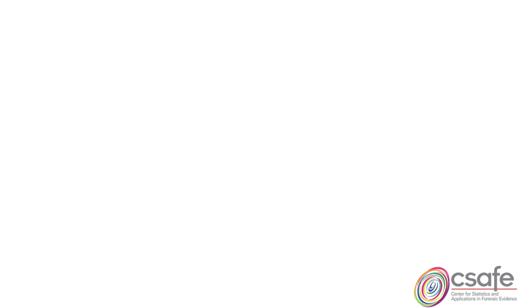
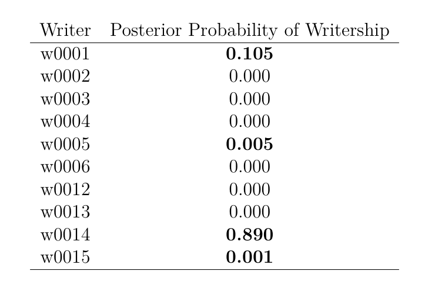

##   A Bayesian Approach to Forensic   Handwriting Evidence  

 

**Amy Crawford**  
Center for Statistics and Applications in Forensic Evidence   
Iowa State University 
July 30, 2018

 

## Statistics in Forensics
  

- 2016 PCAST Report on Forensic
    - President’s Council of Advisors on Science and Technology recommended actions be taken to **strengthen forensic science** and called attention to the **scientific validity** of the analysis of some forms of forensic evidence.
- Questioned documents were an evidence form called to attention.
- Questioned document examiners (QDEs)
    - Proficiency testing
    - Expert *Opinion*
    
## A Situation
  

- Classroom (10 students)
- Threat letter
- Task for QDEs

    

    
# Data

## Computer Vision Lab (CVL)
  

- Vienna University of Technology
- 310 writers
- 7 handwritten texts
- 6 in English, 1 in German

*Sample writing:*

## Feature Extraction with FLASH ID  
  

Sciometrics, LLC  
  
*Example of locations the software may propose breaks.*  

## Graphemes
  

*Example of a grapheme in the FLASH ID interface.*   *SCREENSHOT*

## Grouping Graphemes
  

   
- (a) graphemes with 4 nodes and binary connection code 112 (label 4_112).  
- (b) graphemes with 4 nodes and different binary connection codes.  
- (c) a grapheme with 6 nodes.

## Data  
  

  

## Grapheme Selection
  

- Graphemes are placed in order of importance for predictive analysis using random forest.  

*A few of the most "important" graphemes.*

# Model
  

## Hierarchical Model
  

## Analysis of Questioned Writing  
    
 
   

   
  

## How Many Graphemes?

## Writing Samples
**TOP**: Writer #1   **BOTTOM**: Writer #6  

## How Many Graphemes?

## Writer 3?

## Writing Samples  
**TOP**: Writer #3   **BOTTOM**: Writer #4  

## Density Estimates of Posterior Distn. for $\pi_w$'s
  

## The Situation
  

- Classroom (10 students)
- Threat letter

  

## Threat Letter
  

    

 

## Threat Letter
  

  

